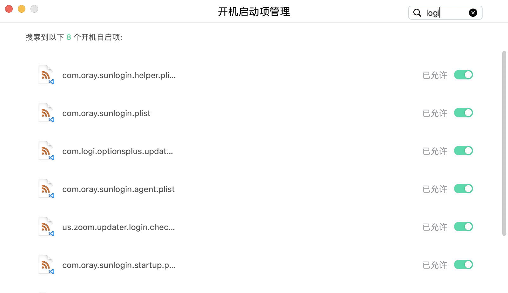
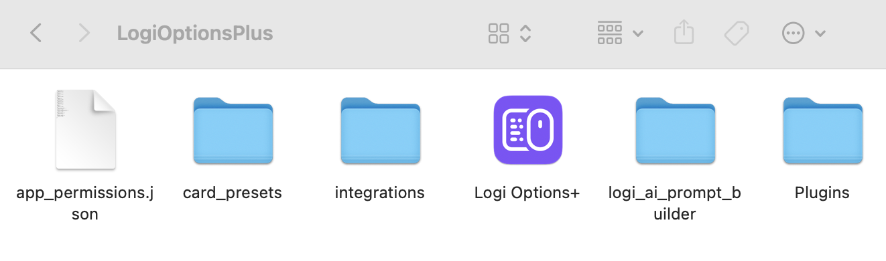
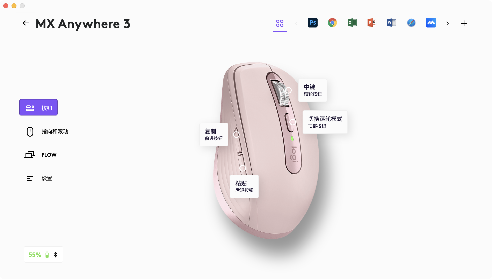

很久没用无线鼠标了，昨天翻出来了anywhere3准备重新用起来，结果发现软件一直加载打不开，卸载了再重装也没办法，于是搜了一些资料最后终于解决了，在这里总结一下

## 第一关：一直卡在“Login item”

在系统设置了反复添加了很多次“登录时打开”，甚至重启了电脑，但在软件里依旧识别不到，一直要求添加权限。
**解决方法：**使用腾讯柠檬等软件来设置开机启动项，因为不仅仅只有option+一个软件，还有一些其他相关联的配置。在“开机启动项管理”里面搜索“logi”，然后把所有的都打开就可以了

## 第二关：Backend connection problem
另外一个老生常谈的问题，搜了下发现百分之九十都是这个问题，不敢相信这么多年过去了罗技竟然还没有修复这个bug
**解决方法：**
- 1 先根据这个路径`/Library/Application Support/Logitech`，找到**LogiOptionPlus**文件夹，然后删除整个文件夹

- 2 接着用腾讯柠檬把option+卸载

- 3 重新安装option+，并且再次检查一下开机启动项配置是否正确

折腾了这么久，终于成功打开！
